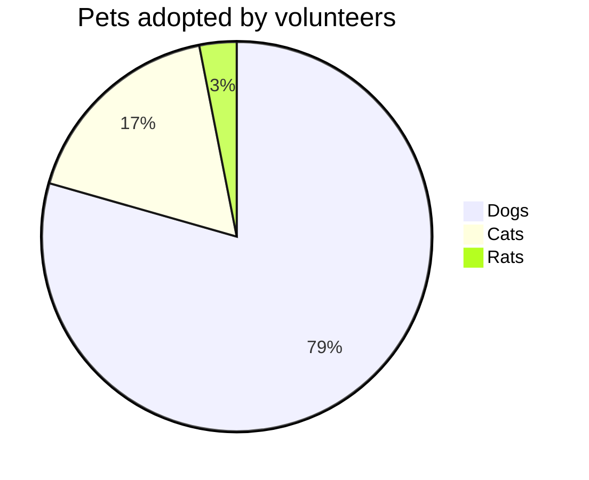

# Estadística

La **estadística** es una _disciplina científica_ que se ocupa de la obtención, orden y análisis de un conjunto de datos con el fin de obtener explicaciones y predicciones sobre fenómenos observados.

La **estadística** consiste en _métodos, procedimientos y fórmulas_ que permiten _recolectar información_ para luego analizarla y extraer de ella _conclusiones relevantes_. Se puede decir que es la **Ciencia de los Datos** y que su principal objetivo es mejorar la _comprensión de los hechos_ a partir de la _información disponible_.

## Tipos de estadística

- **Estadística descriptiva:** Se refiere a los métodos de recolección, organización, resumen y presentación de un conjunto de datos. Se trata principalmente de describir las características fundamentales de los datos y para ellos se suelen utilizar **indicadores**, **gráficos** y **tablas**.

- **Estadística inferencial:** Se refiere a los métodos utilizados para poder hacer predicciones, generalizaciones y obtener conclusiones a partir de los datos analizados teniendo en cuenta el grado de incertidumbre existente.
	- **Estadística paramétrica:** Se caracteriza porque asume que los datos tienen una determinada distribución o se especifican determinados parámetros que deberían cumplirse
	- **[tadística no paramétrica](https://economipedia.com/definiciones/estadistica-no-parametrica.html)**: En ella no es posible asumir ningún tipo de distribución subyacente en los datos ni tampoco un parámetro específico. Un ejemplo de este tipo de análisis es la prueba binomial.

## Gráficos más importantes en estadística

**De barras:** Se utilizan para mostrar la **evolución** o **comportamiento** de una **variable** en el tiempo.

**De pastel o de sectores:** Permite visualizar las partes de un todo a través de una circunferencia dividida en sectores o porciones.

**De líneas o de frecuencias:** Los datos se ordenan en base a los ejes cartesianos— y es útil para observar la evolución de una variable.

**De dispersión:** El punto de partida son también los ejes cartesianos que muestran todos los valores de la variable dependiente y de la independiente, o de dos variables para comprobar si existe relación. El resultado suele ser una nube de puntos que muestra una dispersión o una concentración y ayuda a los estadistas a **determinar la relación o no entre las variables**.

> [!abstract] Tipos de gráficos
> 
>  - Campana De Gauss
>  - Tabla de frecuencias
>  - Grafíco de líneas
>  - Diagrama de caja
>  - Bidireccional
>  - Histograma
>  - Gráfico de líneas
>  - Putos
>  - Polígono de frecuencia
>  - Pictograma

## Las técnicas de recolección de datos en estadística

**Encuesta:** Las encuestas son utilizadas para tener información sobre muchas personas y pueden incluir opción múltiple o preguntas abiertas (como información demográfica, salud, conocimiento, opiniones, creencias, actitudes o habilidades).

**Entrevista:** Durante una entrevista, se hacen preguntas para obtener información detallada sobre el participante acerca del tema de estudio. Las preguntas pueden ser similares a las formuladas en una encuesta.

**Prueba**: Una prueba es una forma o una tarea física o mental para la cual se ha determinado un estándar normal, o para la cual se conoce las respuestas correctas. Las pruebas son usadas en la investigación para determinar la aptitud, habilidad, conocimiento, estado de salud física o mental del participante en comparación a la población en general.

**Evaluaciones Fisiológicas:** Las evaluaciones fisiógicas son medidas en que las características físicas de un participante son registradas, como la presión arterial, ritmo cardíaco o fortaleza física. En una investigación relacionada con la salud, la evaluación fisiológica puede utilizarse para determinar el estado de salud de un participante antes, durante o después de ser parte en un estudio.

**Revisión de registros:** La revisión de registros tiene lugar cuando un investigador examina y extrae información de documentos que contienen datos sobre el participante.

**Muestras Biológicas:** Las muestras biológicas son substancias (sangre, orina, saliva) que son tomadas de una persona y se utilizan para medir información fisiológica.

## Aplicaciones en la ciencia y en la vida cotidiana

- **En economía**: suministra los valores que ayudan a descubrir interrelaciones entre múltiples parámetros macro y microeconómicos.

- **En las ciencias sociales y económicas**: es un pilar básico del desarrollo de la demografía y la sociología aplicada.

- **En las ciencias médicas**: permite establecer pautas sobre la evolución de las enfermedades y los enfermos, los índices de mortalidad asociados a procesos morbosos, el grado de eficacia de un medicamento, etcétera.

## Referencias

- Economipedia. (01 marzo, 2020). _Estadística_. https://economipedia.com/definiciones/estadistica.html

- Unir (s.f.). _Gráficos estadísticos: tipos e importancia en la comunicación de datos_. https://www.unir.net/marketing-comunicacion/revista/graficos-estadisticos/

- ORI. (s.f.). _Sección 1: Metodos de Recaudación de Información_. https://ori.hhs.gov/m%C3%B3dulo-4-m%C3%A9todos-de-recaudaci%C3%B3n-de-informaci%C3%B3n-secci%C3%B3n-1