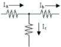
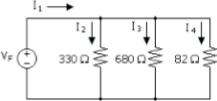
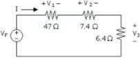
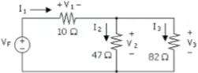
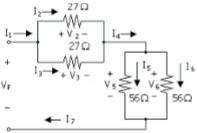
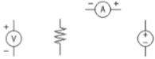

Manual de Prácticas
LABORATORIO DE CIRCUITOS ELECTRICOS
Práctica # 4
LEYES DE KIRCHHOFF

**OBJETIVO:**

1. Comprobar experimentalmente las Leyes de Kirchhoff.

**EXPOSICIÓN:**

Las Leyes de Kirchhoff constituyen la base para el análisis de los cirucitos eléctricos. Sus conceptos básicos son tan amplios que pueden aplicarse a cualquier circuito, desde el circuito más sencillo, hasta la red más compleja.

- <u>Primera Ley</u>: LEY DE CORRIENTES DE KIRCHHOFF: "La suma algebraica de las corrientes que entran a (o salen de) una unión de dos o más elementos es igual a cero".

Esto significa que la suma de las corrientes que entran a la unión es igual a la suma de las corrientes que salen de ella.

fig 4-1

Ia - Ib - Ic = 0     ó     Ia = Ib + Ic 

- Segunda Ley: LEY DE VOLTAJES DE KIRCHHOFF: "La suma algebraica de las diferencias de potencial alrededor de cualquier trayectoria cerrada en un circuito es cero".

Esto significa que un circuito cerrado, la suma de las elevaciones de tensión es igual a la suma de las caídas de tensión.

fig 4-2

V1 - V2 - V3 = 0     ó     V1 = V2 + V3 

---
**MATERIAL Y EQUIPO:**

Resistencias de:
- 6.4
- 7.4
- 10
- 27 (2)
- 47
- 56
- 82
- 330
- 680

Fuente de alimentación
Multímetro digital
Cables de conexión

**PROCEDIMIENTO:**

1) a) Examine el circuito de la figura 4-3. Realice los cálculos que se piden.

fig 4-3

b) Conecte el circuito de la fígura 4-3. Ajuste el voltaje de la fuente (VF) a 4 V. Mida y anote:

Valores Calculados:
VF =
I1  =
I2  =
I3  =
I4  =

Valores Medidos:
VF =
I1  =
I2  =
I3  =
I4  =

Porcentaje de error:
%e =
%e =
%e =
%e =
%e =

c) Calcule el porcentaje de error.
d) Anexe sus cálculos al final de la práctica.

2) a) Examine el circuito de la figura 4-4. Realice los cálculos que se piden

fig 4-4

b) Conecte el circuito de la figura 4-4. Ajuste el voltaje de la fuente (VF) a 3 V. Mida y anote:

Valores Calculados:
VF =
I = 
V1  =
V2  =
V3  =

Valores Medidos:
VF =
I = 
V1  =
V2  =
V3  =

Porcentaje de error:
%e =
%e =
%e =
%e =
%e =

c) Calcule el porcentaje de error.
d) Anexe sus cálculos al final de la práctica.

a) Examine el circuito de la figura 4-5. Realice los cálculos que se piden

fig 4-5

b) Conecte el circuito de la figura 4-5. Ajuste el voltaje de la fuente (VF) a 4 V. Mida y anote:

Valores Calculados:
VF =
V1  =
V2  =
V3  =
I1  =
I2  =
I3  =

Valores Medidos:
VF =
V1  =
V2  =
V3  =
I1  =
I2  =
I3  =

Porcentaje de error:
%e =
%e =
%e =
%e =
%e =
%e =
%e =

c) Calcule el porcentaje de error.
d) Anexe sus cálculos al final de la práctica.

4. a) Examine el circuito de la figura 4-6. Realice los cálculos que se piden.

fig 4-6

b) Conecte el circuito de la figura 4-6. Ajuste el voltaje de la fuente (VF) a 5 V. Mida y anote:

Valores Calculados:
VF =
V2  =
V3  =
V4  =
V5  =
V6  =
I1  =
I2  =
I3  =
I4  =
I5  =
I6  =
I7  =

Valores Medidos:
VF =
V2  =
V3  =
V4  =
V5  =
V6  =
I1  =
I2  =
I3  =
I4  =
I5  =
I6  =
I7  =

Porcentaje de error:
%e =
%e =
%e =
%e =
%e =
%e =
%e =
%e =
%e =
%e =
%e =
%e =
%e =

**PRUEBA DE CONOCIMIENTOS:**

1. ¿Estuviieron dentro de la tolerancia los porcentajes de error encontrados en esta práctica?

2. Complete la figura 4-7 de forma que quede un circuito completo

3. ¿Se quemaría un amperímetro de la fig 4-7 si se conectara la polaridad invertida?

	¿Por qué?

4. ¿Cuál de los medidores de la figura 4-7 tendrían más posibilidades de quemarse si se conectara directamente en paralelo con la fuente de energía?

	¿Por qué?

5. Si se invirtiera la polaridad de voltaje aplicado en la figura 4-7, ¿qué sucedería con las corrientes y los voltajes del circuito?

**CONCLUSIONES:**