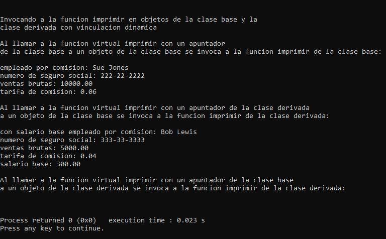

# <center>Universidad de Guadalajara</center>

## <center>Centro Universitario de Ciencias Exactas E Ingenierías</center>

 
 
<br> <br> <br> <br> <br><br> <br><br><br><br><br><br><br><br><br><br><br>

### División de Tecnologías para la Integración Ciber-humana

### Departamento de Ciencias Computacionales

#### Tarea 4

#### Tema: Funciones virtuales

#### Estudiante: Juárez Rubio Alan Yahir

#### Materia: Programación Orientada a Objetos

#### Sección: D03

#### Calendario: 2023-A

#### Profesor: Mariscal Lugo Luis Felipe

#### Fecha de entrega: 01/05/2023

<div style="page-break-after: always;"></div>

# Marco Teórico

<!-- (Resumen del apartado 13.3.4 Funciones virtuales pág. 591 (media página), capturar y probar el programa de la Figura 13.8, 13.9, 13.10 (se exportará el código fuente en formato RTF), anexar las imágenes de la corrida del programa. Anexar el apartado 13.3.5 Resumen de las asignaciones permitidas entre objetos y apuntadores de la clase base y de la clase derivada pág. 596. Bibliografía al final del marco teórico en formato APA)  -->

## Funciones Virtuales

Recuerde que el tipo del manejador determina cuál funcionalidad de la clase se va a invocar.

Con las funciones virtual, el tipo del objeto al que se está apuntando, y no el tipo del manejador, es el que determina cuál versión de una función virtual se debe invocar.

Primero vamos a considerar por qué son útiles las funciones virtual. Suponga que un conjunto de clases de figuras como Circulo, Triangulo, Rectangulo y Cuadrado se derivan de la clase base Figura. Cada una de estas clases podría estar dotada con la habilidad de dibujarse a sí misma a través de una función miembro llamada dibujar. Aunque cada clase tiene su propia función dibujar, la función para cada figura es bastante distinta. En un programa que dibuja un conjunto de figuras, podría ser útil poder tratar a todas las figuras en forma genérica como objetos de la clase base Figura.

Después, para dibujar cualquier figura podríamos simplemente usar un apuntador de la clase base Figura para invocar a la función dibujar, y dejar que el programa determine en forma dinámica

Para permitir este tipo de comportamiento, declaramos a dibujar en la clase base como una función virtual, y sobrescribimos a dibujar en cada una de las clases derivadas para dibujar la figura apropiada.

Una función sobrescrita en una clase derivada tiene la misma firma y el mismo tipo de valor de retorno (es decir, prototipo) que la función que sobrescribe en su clase base. Si no declaramos la función de la clase base como virtual, podemos redefinir esa función. En contraste, si declaramos la función de la clase base como virtual, podemos sobrescribir esa función para permitir el comportamiento polimórfico. Para declarar una función virtual, anteponemos al prototipo de la función la palabra clave virtual en la clase base. Por ejemplo

`virtual void dibujar() const`;

Esta función se declara const debido a que, por lo general, una función dibujar no realizaría modificaciones al objeto Figura en el cual se invoca; las funciones virtuales no tienen que ser funciones const.

La vinculación dinámica con las funciones virtual solo ocurre a partir de manejadores tipo apuntador (y de referencias).

Como las funciones ingresos e imprimir son virtual en la clase EmpleadoPorComision, las funciones ingresos e imprimir de la clase EmpleadoBaseMasComision sobrescriben a las de la clase EmpleadoPorComision. Ahora, si orientamos un apuntador de la clase base EmpleadoPorComision a un objeto de la clase derivada EmpleadoBaseMasComision, y el programa utiliza ese apuntador para llamar a la función ingresos o imprimir, se invocará la función correspondiente del objeto EmpleadoBaseMasComision. No hubo modificaciones a las implementaciones de las funciones miembro de las clases EmpleadoPorComision y EmpleadoBaseMas-Comision, por lo que reutilizamos las versiones de las figuras 13.2 y 13.4.

Observe que, en la figura 13.5, cuando en la línea 67 se invoca a la función miembro imprimir desde el apuntador de la clase base, se invoca a la función miembro imprimir de la clase derivada EmpleadoBaseMasComision, por lo que en la línea 67 se imprime un texto distinto al de la línea 59 (cuando la función miembro print no se declaró virtual).

```cpp
// Fig. 13.8: EmpleadoPorComision.h
// Definición de la clase EmpleadoPorComision que representa a un empleado por comisión.
#ifndef COMISION_H
#define COMISION_H

#include <string> // clase string estándar de C++
using std::string;

class EmpleadoPorComision
{
	public:
	EmpleadoPorComision( const string &, const string &, const string &,
	double = 0.0, double = 0.0 );

	void setPrimerNombre( const string & ); // establece el primer nombre
	string getPrimerNombre() const; // devuelve el primer nombre

	void setApellidoPaterno( const string & ); // establece el apellido paterno
	string getApellidoPaterno() const; // devuelve el apellido paterno

	void setNumeroSeguroSocial( const string & ); // establece el NSS
	string getNumeroSeguroSocial() const; // devuelve el NSS

	void setVentasBrutas( double ); // establece el monto de ventas brutas
	double getVentasBrutas() const; // devuelve el monto de ventas brutas

	void setTarifaComision( double ); // establece la tarifa de comisión
	double getTarifaComision() const; // devuelve la tarifa de comisión

	virtual double ingresos() const; // calcula los ingresos
	virtual void imprimir() const; // imprime el objeto EmpleadoPorComision
private:
	string primerNombre;
	string apellidoPaterno;
	string numeroSeguroSocial;
	double ventasBrutas; // ventas brutas por semana
	double tarifaComision; // porcentaje de comisión
}; // fin de la clase EmpleadoPorComision

#endif
```

Figura 13.8 | Archivo de encabezado de la clase EmpleadoPorComision, que declara a las funciones ingresos e imprimir como virtual.

```cpp
// Fig. 13.9: EmpleadoBaseMasComision.h
// Clase EmpleadoBaseMasComision derivada de la clase
// EmpleadoPorComision.
#ifndef BASEMAS_H
#define BASEMAS_H

#include <string> // clase string estándar de C++
using std::string;

#include "EmpleadoPorComision.h" // declaración de la clase EmpleadoPorComision

class EmpleadoBaseMasComision : public EmpleadoPorComision
{
public:
	EmpleadoBaseMasComision( const string &, const string &,
		const string &, double = 0.0, double = 0.0, double = 0.0 );
	
	void setSalarioBase( double ); // establece el salario base
	double getSalarioBase() const; // devuelve el salario base
	
	virtual double ingresos() const; // calcula los ingresos
	virtual void imprimir() const; // imprime el objeto EmpleadoBaseMasComision
private:
double salarioBase; // salario base
}; // fin de la clase EmpleadoBaseMasComision

#endif
```

Figura 13.9 | Archivo de encabezado de la clase EmpleadoBaseMasComision que declara a las funciones ingresos e imprimir como virtual.

```cpp
// Fig. 13.10: fig13_10.cpp
// Introducción al polimorfismo, las funciones virtuales y la vinculación postergada.
#include <iostream>
using std::cout;
using std::endl;
using std::fixed;

#include <iomanip>
using std::setprecision;

// incluye las definiciones de las clases
#include "EmpleadoPorComision.h"
#include "EmpleadoBaseMasComision.h"

int main()
	{
	// crea un objeto de la clase base
	EmpleadoPorComision empleadoPorComision(
		"Sue", "Jones", "222-22-2222", 10000, .06 );
	
	// crea un apuntador de la clase base
	EmpleadoPorComision *empleadoPorComisionPtr = 0;
	
	// crea un objeto de la clase derivada
	EmpleadoBaseMasComision empleadoBaseMasComision(
		"Bob", "Lewis", "333-33-3333", 5000, .04, 300 );
	
	// crea un apuntador de la clase derivada
	EmpleadoBaseMasComision *empleadoBaseMasComisionPtr = 0;
	
	// establece el formato de salida de punto flotante
	cout << fixed << setprecision( 2 );
	
	// imprime los objetos usando la vinculación estática
	cout << "Invocando a la funcion imprimir en objetos de la clase base "
		<< "\ny la clase derivada con vinculacion estatica\n\n";
	empleadoPorComision.imprimir(); // vinculación estática
	cout << "\n\n";
	empleadoBaseMasComision.imprimir(); // vinculación estática
	
	// imprime los objetos usando vinculación dinámica
	cout << "\n\n\nInvocando a la funcion imprimir en objetos de la clase base "
		<< "y la \nclase derivada con vinculacion dinamica";
	
	// orienta el apuntador de la clase base al objeto de la clase base e imprime
	empleadoPorComisionPtr = &empleadoPorComision;
	cout << "\n\nAl llamar a la funcion virtual imprimir con un apuntador"
		<< "\nde la clase base a un objeto de la clase base se invoca a la "
		<< "funcion imprimir de la clase base:\n\n";
	empleadoPorComisionPtr->imprimir(); // invoca a la función imprimir de la clase base
	
	// orienta un apuntador de la clase derivada al objeto de la clase derivada e imprime
	empleadoBaseMasComisionPtr = &empleadoBaseMasComision;
	cout << "\n\nAl llamar a la funcion virtual imprimir con un apuntador "
		<< "de la clase derivada\na un objeto de la clase base se invoca a "
		<< "la funcion imprimir de la clase derivada:\n\n";
	empleadoBaseMasComisionPtr->imprimir(); // invoca a la función imprimir de la clase derivada
	
	// orienta un apuntador de la clase base a un objeto de la clase derivada e imprime
	empleadoPorComisionPtr = &empleadoBaseMasComision;
	cout << "\n\nAl llamar a la funcion virtual imprimir con un apuntador de la clase base"
		<< "\na un objeto de la clase derivada se invoca a la funcion "
		<< "imprimir de la clase derivada:\n\n";
	
	// polimorfismo; invoca a la función imprimir de EmpleadoBaseMasComision;
	// apuntador de la clase base a un objeto de la clase derivada
	
	cout << endl;
	return 0;
} // fin de main
```

Figura 13.10 | Demostración del polimorfismo al invocar una función virtual de la clase derivada a través de un apuntador de la clase base a un objeto de la clase derivada.

### Corrida del Programa


<div style="page-break-after: always;"></div>

## Resumen de las asignaciones permitidas entre objetos y apuntadores de la clase base y de la clase derivada

Los objetos de la clase derivada se pueden tratar como si fueran objetos de la clase base. Ésta es una relación lógica, ya que la clase derivada contiene todos los miembros de la clase base. Sin embargo, los objetos de la clase base no pueden tratarse como si fueran objetos de la clase derivada; la clase derivada puede tener miembros adicionales que solo pertenezcan a ésta. Por esta razón, orientar un apuntador de la clase derivada a un objeto de la clase base no se permite sin una conversión explicita; dicha asignación dejaría a los miembros que solo pertenecen a la clase derivada indefinidos en el objeto de la clase base

Hemos visto cuatro formas de orientar los apuntadores de la clase base y los apuntadores de la clase derivada a objetos de la clase base y objetos de la clase derivada:

1. Orientar un apuntador de la clase base a un objeto de la clase base es un proceso simple y directo: las llamadas realizadas desde el apuntador de la clase base simplemente invocan la funcionalidad de la clase base.

2. Orientar un apuntador de la clase derivada a un objeto de la clase derivada es un proceso simple y directo: las llamadas realizadas desde el apuntador de la clase derivada simplemente invocan la funcionalidad de la clase derivada.

3. Orientar un apuntador de la clase base a un objeto de la clase derivada es un proceso seguro, ya que el objeto de la clase derivada es un objeto de su clase base. Sin embargo, este apuntador se puede utilizar para invocar solo a las funciones miembro de la clase base. Si tratamos de hacer referencia a un miembro que solo pertenezca a la clase derivada a través del apuntador de la clase base, el compilador reporta un error. Para evitar este error, debemos convertir el apuntador de la clase base a un apuntador de la clase derivada. Así, el apuntador de la clase derivada se puede utilizar para invocar la funcionalidad completa del objeto de la clase derivada; en la sección 13.8 se demuestra cómo utilizar la conversión descendente con seguridad. Si se define una función virtual en las clases

<div style="page-break-after: always;"></div>

## Conslusión

Para entender este tema, es necesario primero entender el cómo funcionan los apuntadores y cómo funciona la herencia para así poder comprender los "enlaces" que cada uno de los métodos de la clase base tiene con los de sus clases derivadas.

Es de vital importancia entender que, una función de la clase base como virtual puede ser sobrescrita; por otra parte, una función no virtual, en el que en vez de ser sobrescrita, se redefine.

Para finalizar, es de vital impotancia mencionar que al llamar a una función virtual con un apuntador de la clase base a un objeto de la clase base se invoca a la dicha función de la clase base, en cualquier otro caso, se invocará la función derivada.

<!--bbb
dbd
bdd-->

<div style="page-break-after: always;"></div>

# Referencias

- M. H & J., P. (2008). Funciones Virtuales. En Luis Cruz (Ed.), _Cómo programar en C++_ (6<sup>a</sup> ed.). (pp. 591-596). Editorial Pearson Educación.
- M. H & J., P. (2008). Resumen de las asignaciones permitidas entre objetos y apuntadores de la clase base y de la clase derivada. En Luis Cruz (Ed.), _Cómo programar en C++_  (6<sup>a</sup> ed.). (pp. 596-597). Editorial Pearson Educación.
