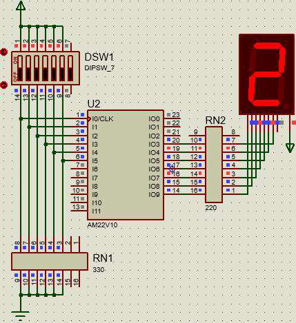
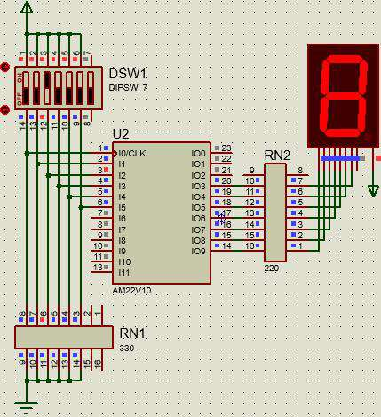
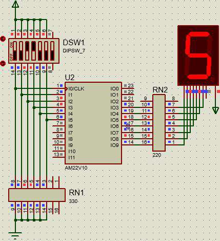
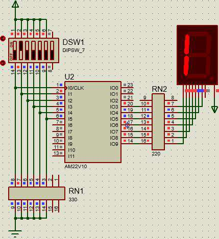
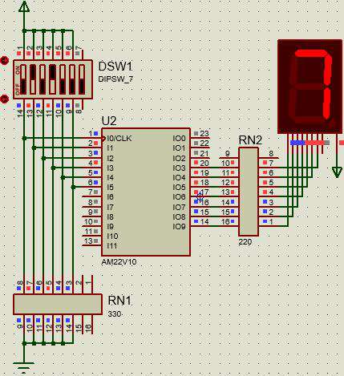
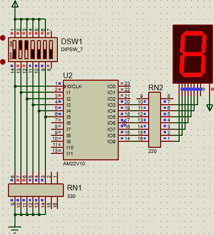
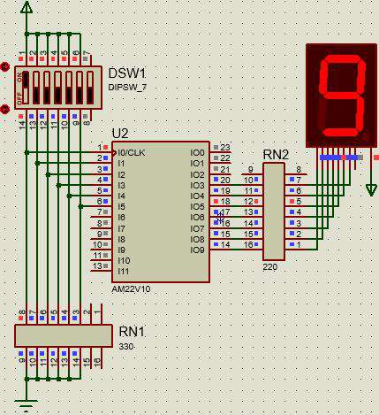
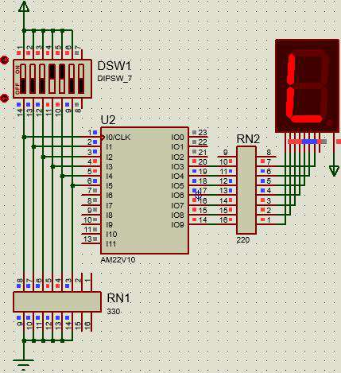

# <center>Universidad de Guadalajara</center>

## <center>Centro Universitario de Ciencias Exactas E Ingenierías</center>


 

<br> <br> <br> <br> <br> <br> <br> <br> <br> <br> <br> <br> <br> <br> <br> <br>

### División de Tecnologías para la Integración Ciber-humana

### Departamento de Ciencias Computacionales

#### Actividad 11: Código y nombre de estudiante en 7 segmentos

#### Estudiante: Juárez Rubio Alan Yahir

#### Materia: Sistemas Digitales

#### Sección: D08

#### Calendario: 2023-A

#### Profesor: Villegas González José Martin

#### NRC: 194956

#### Fecha de entrega: 11/05/2023

<div style="page-break-after: always;"></div>

# Código y nombre de Estudiante en 7 segmentos


<!-- Circuito Integrador 555 -->

## Tablas de verdad

|  A  |  B  |  C  |  D  |     |  a  |  b  |  c  |  d  |  e  |  f  |  g  | Nombre |
|:---:|:---:|:---:|:---:|:---:|:---:|:---:|:---:|:---:|:---:|:---:|:---:|:------:|
|  0  |  0  |  0  |  0  |     |  0  |  0  |  0  |  1  |  0  |  0  |  0  |   A    |
|  0  |  0  |  0  |  1  |     |  1  |  1  |  1  |  0  |  0  |  0  |  1  |   L    |
|  0  |  0  |  1  |  0  |     |  0  |  0  |  0  |  1  |  0  |  0  |  0  |   A    |
|  0  |  0  |  1  |  1  |     |  0  |  0  |  0  |  1  |  0  |  0  |  1  |   N    |

|  A  |  B  |  C  |  D  |     |  a  |  b  |  c  |  d  |  e  |  f  |  g  | Código |
|:---:|:---:|:---:|:---:|:---:|:---:|:---:|:---:|:---:|:---:|:---:|:---:|:------:|
|  0  |  0  |  0  |  0  |     |  0  |  0  |  1  |  0  |  0  |  1  |  0  |   2    |
|  0  |  0  |  0  |  1  |     |  1  |  1  |  1  |  1  |  0  |  0  |  1  |   1    |
|  0  |  0  |  1  |  0  |     |  0  |  0  |  0  |  0  |  0  |  0  |  0  |   8    |
|  0  |  0  |  1  |  1  |     |  0  |  1  |  0  |  0  |  1  |  0  |  0  |   5    |
|  0  |  1  |  0  |  0  |     |  1  |  1  |  1  |  1  |  0  |  0  |  1  |   1    |
|  0  |  1  |  0  |  1  |     |  0  |  0  |  0  |  1  |  1  |  1  |  1  |   7    |
|  0  |  1  |  1  |  0  |     |  0  |  0  |  0  |  0  |  0  |  0  |  0  |   8    |
|  0  |  1  |  1  |  1  |     |  0  |  0  |  0  |  0  |  0  |  0  |  1  |   0    |
|  1  |  0  |  0  |  0  |     |  0  |  0  |  0  |  0  |  1  |  0  |  0  |   9    |

<div style="page-break-after: always;"></div>

## Códigos

### PLD

```pld
Name     Nombre y código ;
PartNo   00 ;
Date     11/05/2023 ;
Revision 01 ;
Designer Engineer ;
Company  CUCEI ;
Assembly None ;
Location ;
Device   g22v10 ;

/* **************** INPUT PINS **********************/
PIN 1 = A; /*                                       */ 
PIN 2 = B; /*                                       */ 
PIN 3 = C; /*                                       */ 
PIN 4 = D; /*                                       */ 
PIN 5 = X; /*                                       */
PIN 6 = E; 

/* **************** OUTPUT PINS *********************/
PIN 14 = SEGA; /*                                   */ 
PIN 15 = SEGB; /*                                   */ 
PIN 16 = SEGC; /*                                   */ 
PIN 17 = SEGD; /*                                   */ 
PIN 18 = SEGE; /*                                   */ 
PIN 19 = SEGF; /*                                   */ 
PIN 20 = SEGG; /*                                   */ 

SEGA = ((!C) & D)  & X # ((B & (!C) & (!D))           # ((!B) & (!C) & D))              & (!X);
SEGB = ((!C) & D)  & X # ((B & (!C) & (!D))           # ((!B) & D))                     & (!X);
SEGC = ((!C) & D)  & X # (((!B) & (!C) & D)           # ((!A) & (!C) & (!D)))           & (!X);
SEGD = ((!D) # C)  & X # (((!C) & D)                  # (B & (!C)))                     & (!X);
SEGE = (E)         & X # ((B & (!C) & D)              # ((!B) & C & D)       # (A))     & (!X);
SEGF = (E)         & X # (((!A) & (!B) & (!C) & (!D)) # (B & (!C) & D))                 & (!X);
SEGG = (D)         & X # (((!C) & D)                  # (B & (!C))           # (B & D)) & (!X);

```

### jed

```jed

CUPL(WM)        5.0a  Serial# 60008009
Device          g22v10  Library DLIB-h-40-1
Created         Thu May 11 09:36:29 2023
Name            Nombre 
Partno          00 
Revision        01 
Date            11/05/2023 
Designer        Engineer 
Company         
Assembly        None 
Location        
*QP24 
*QF5892 
*G0 
*F0 
*L01472 00000000000000000000000011111111
*L01504 11111111111111111111111111111111
*L01536 11111111111111110111011111111111
*L01568 11111111111111111111111110110111
*L01600 10111111111111111111111111111111
*L01632 01111111011110111111111111111111
*L01664 11111111111101111011111110111111
*L01696 11111111111111111111000000000000
*L02144 00000000000011111111111111111111
*L02176 11111111111111111111111111111111
*L02208 11111111011101111111111111111111
*L02240 11111111011110110111101111111111
*L02272 11111111111111111011101110111011
*L02304 10111111111111111111111111110000
*L02880 00000000000000000000000011111111
*L02912 11111111111111111111111111111111
*L02944 11111111111111111111011101111111
*L02976 11111111111111111111011110110111
*L03008 10111111111111111111111111111111
*L03040 10110111011110111111111111111111
*L03072 11111111011111111111111110111111
*L03104 11111111111111111111000000000000
*L03648 00001111111111111111111111111111
*L03680 11111111111111111111111111111011
*L03712 01111111111111111111111111111111
*L03744 11110111111101111111111111111111
*L03776 11111111111101111011111110111111
*L03808 11111111111111111111111111111011
*L03840 01111011111111111111111111111111
*L04288 00000000000000000000000011111111
*L04320 11111111111111111111111111111111
*L04352 11111111111110110111011111111111
*L04384 11111111111111111011111110111011
*L04416 10111111111111111111111111111111
*L04448 10111011011110111111111111111111
*L04480 11111111000000000000000000000000
*L04864 00000000000000000000111111111111
*L04896 11111111111111111111111111111111
*L04928 11111111101101110111111111111111
*L04960 11111111111111111011111101111011
*L04992 11111111111111111111111111110111
*L05024 10111011101111111111111111111111
*L05056 11110000000000000000000000000000
*L05344 00000000000000000000000011111111
*L05376 11111111111111111111111111111111
*L05408 11111111111110110111011111111111
*L05440 11111111111111111111101110110111
*L05472 10111111111111111111111111111111
*L05504 01111011101110111111111111111111
*L05536 11111111000000000000000000000000
*L05792 00000000000000000000001111111111
*L05824 11110011000000110000001000000000
*CA952
*E22F
```

<div style="page-break-after: always;"></div>

## Simulación en Proteus

### Código: 218517809




<center>Fig. 1 Código - 1° dígito: 2</center>


<center>Fig. 2 Código - 2° dígito</center>



<center>Fig. 3 Código - 3° dígito</center>



<center>Fig. 4 Código - 4° dígito</center>



<center>Fig. 5 Código - 5° dígito</center>



<center>Fig. 6 Código - 6° dígito</center>



<center>Fig. 7 Código - 7° dígito</center>


<center>Fig. 8 Código - 8° dígito</center>



<center>Fig. 9 Código - 9° dígito</center>

### Nombre: Alan


<center>Fig. 10 Código - 1° dígito</center>



<center>Fig. 11 Código - 2° dígito</center>


<center>Fig. 12 Código - 3° dígito</center>


<center>Fig. 13 Código - 4° dígito</center>

<div style="page-break-after: always;"></div>

## Conclusión

Para finalizar, es importante entender el funcionamiento de un display de 7 segmentos para poder trabajar con él. También es importante aprender a codificar de manera correcta, utilizando la sintaxis correcta para evitar errores, especialmente cuanto se escriben las expresiones booleanas.

<div style="page-break-after: always;"></div>

## Referencias

- Notas de clase