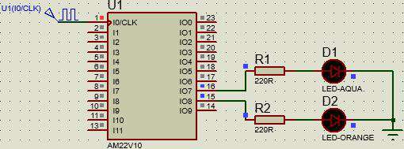
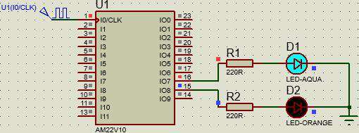
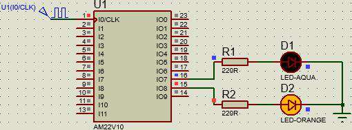
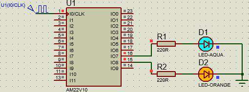

# <center>Universidad de Guadalajara</center>

## <center>Centro Universitario de Ciencias Exactas E Ingenierías</center>


 

<br> <br> <br> <br> <br> <br> <br> <br> <br> <br> <br> <br> <br> <br> <br> <br>

### División de Tecnologías para la Integración Ciber-humana

### Departamento de Ciencias Computacionales

#### Actividad 12: Máquina de Estados

#### Estudiante: Juárez Rubio Alan Yahir

#### Materia: Sistemas Digitales

#### Sección: D08

#### Calendario: 2023-A

#### Profesor: Villegas González José Martin

#### NRC: 194956

#### Fecha de entrega: 21/05/2023

<div style="page-break-after: always;"></div>

# Maquina de Estados

## Tabla de Verdad

| Q1  | Q0  |     | Q1  | SegB |
|:---:|:---:| --- |:---:|:----:|
|  0  |  0  |     |  1  |  1   |
|  1  |  0  |     |  0  |  1   |
|  1  |  1  |     |  0  |  1   |
|  1  |  1  |     |  1  |  1   | 

<div style="page-break-after: always;"></div>

## Código

### PLD
```pld
Name     Maquina de Estados ;
PartNo   00 ;
Date     21/05/2023 ;
Revision 01 ;
Designer Engineer ;
Company  CUCEI ;
Assembly None ;
Location  ;
Device   g22v10 ;

/* *************** INPUT PINS *********************/
PIN 1  = clk ; /*                                 */ 
PIN 15 = Q1  ; /*                                 */ 
PIN 16 = Q0  ; /*                                 */ 

FIELD estados = [Q1, Q0];

$define S0 'b'00
$define S1 'b'01
$define S2 'b'10
$define S3 'b'11

SEQUENCE estados {
PRESENT S0 NEXT S1;
PRESENT S1 NEXT S2;
PRESENT S2 NEXT S3;
PRESENT S3 NEXT S0;
}
```

### JED

```jed

CUPL(WM)        5.0a  Serial# 60008009
Device          g22v10  Library DLIB-h-40-1
Created         Sun May 21 09:32:59 2023
Name            Maquina de Estados 
Partno          00 
Revision        01 
Date            21/05/2023 
Designer        Engineer 
Company         CUCEI 
Assembly        None 
Location        
*QP24 
*QF5892 
*G0 
*F0 
*L04288 00000000000000000000000011111111
*L04320 11111111111111111111111111111111
*L04352 11111111111111111111111111111111
*L04384 11011111111111110000000000000000
*L04864 00000000000000000000111111111111
*L04896 11111111111111111111111111111111
*L04928 11111111111111111111111111111101
*L04960 11101111111111111111111111111111
*L04992 11111111111011011111111100000000
*L05792 00000000000000000000000000000010
*L05824 10000011000000110000001000000000
*C1D42
*A92E
```

<div style="page-break-after: always;"></div>

## Simulación en Proteus



<center>Figura 1. Estado 1: 00</center>



<center>Figura 2. Estado 2: 01</center>



<center>Figura 3. Estado 3: 10</center>



<center>Figura 4. Estado 4: 11</center>

<div style="page-break-after: always;"></div>

## Conclusión

En conclusión, una máquina de estados es un modelo que describe el comportamiento secuencial de un sistema o proceso, definiendo los estados posibles, las transiciones entre ellos y las acciones asociadas a cada transición. Esto permite representar y controlar el flujo de ejecución de un sistema de manera estructurada y predecible.

<div style="page-break-after: always;"></div>

## Referencias

- Notas del curso