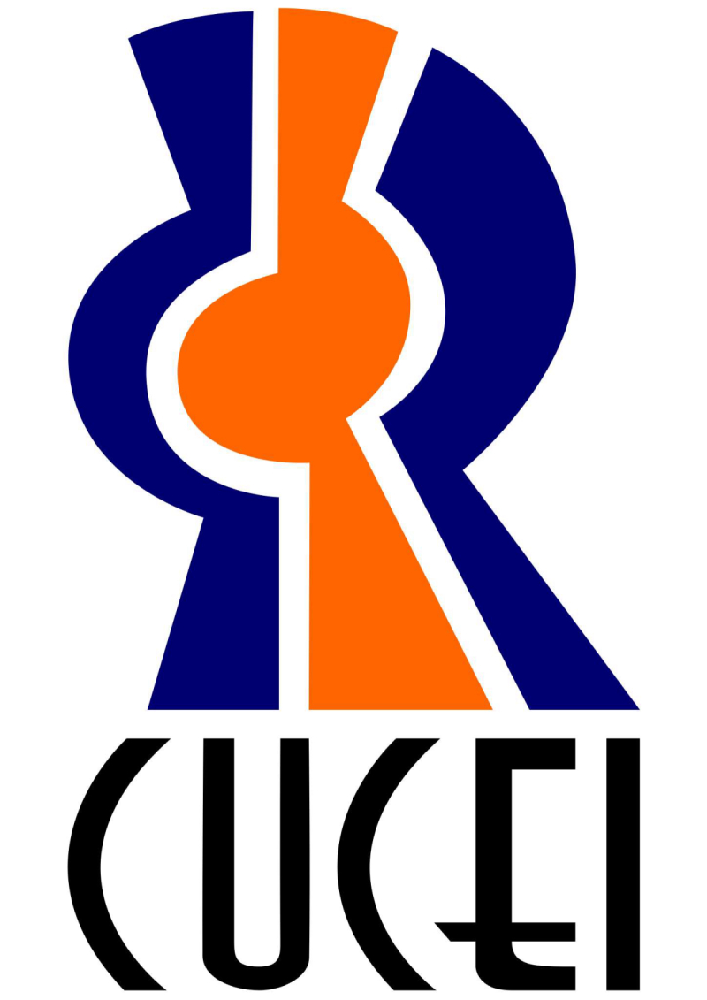
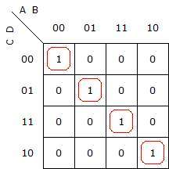

# <p align="center">Universidad de Guadalajara

## <p align="center">Centro Universitario de Ciencias Exactas E Ingenierías<br>

 

<br> <br> <br> <br> <br><br> <br><br><br><br><br><br><br><br><br><br>

### División de Tecnologías para la Integración Ciber-humana

### Departamento de Ciencias Computacionales

#### Actividad 9: Comparador

#### Estudiante: Juárez Rubio Alan Yahir

#### Materia: Sistemas Digitales

#### Sección: D08

#### Calendario: 2023-A

#### Profesor: Villegas González José Martin

#### NRC: 194956

#### Fecha de entrega: 25/04/2023

<div style="page-break-after: always;"></div>

# Comparador de 2 palabras de 2 bits

AB < CD 
AB = CD
AB > CD

m = 2⁴ = |16 combinaciones

## Expresión Booleana

(~A*~B*D)+(~B*C*D)+(~A*C)

## Tabla de verdad

| m   | A   | B   | C   | D   |     | m   | i   | M   |
| --- | --- | --- | --- | --- | --- | --- | --- | --- |
| 0   | 0   | 0   | 0   | 0   |     | 0   | 1   | 0   |
| 1   | 0   | 0   | 0   | 1   |     | 1   | 0   | 0   |
| 2   | 0   | 0   | 1   | 0   |     | 1   | 0   | 0   |
| 3   | 0   | 0   | 1   | 1   |     | 1   | 0   | 0   |
| 4   | 0   | 1   | 0   | 0   |     | 0   | 0   | 1   |
| 5   | 0   | 1   | 0   | 1   |     | 0   | 1   | 0   |
| 6   | 0   | 1   | 1   | 0   |     | 1   | 0   | 0   |
| 7   | 0   | 1   | 1   | 1   |     | 1   | 0   | 0   |
| 8   | 1   | 0   | 0   | 0   |     | 0   | 0   | 1   |
| 9   | 1   | 0   | 0   | 1   |     | 0   | 0   | 1   |
| 10  | 1   | 0   | 1   | 0   |     | 0   | 1   | 0   |
| 11  | 1   | 0   | 1   | 1   |     | 1   | 0   | 0   |
| 12  | 1   | 1   | 0   | 0   |     | 0   | 0   | 1   |
| 13  | 1   | 1   | 0   | 1   |     | 0   | 0   | 1   |
| 14  | 1   | 1   | 1   | 0   |     | 0   | 0   | 1   |
| 15  | 1   | 1   | 1   | 1   |     | 0   | 1   | 0   |


## Mapas de Karnout


<center>Fig 1. Mapa m</center>



<center>Fig 2. Mapa i</center>


<center>Fig. 3. Mapa M</center>


## Archivo jed

``` JED

BOOLE-DEUSTO 
type: GAL22V10*
QP24*
QF5828*
QV0*
G0*
F0*
L0044 11 11 11 11 11 11 11 11 11 11 11 11 11 11 11 11 11 11 11 11 11 11 *
L0088 11 11 10 11 10 11 11 11 01 11 11 11 11 11 11 11 11 11 11 11 11 11 *
L0132 11 11 11 11 10 11 01 11 01 11 11 11 11 11 11 11 11 11 11 11 11 11 *
L0176 11 11 10 11 11 11 01 11 11 11 11 11 11 11 11 11 11 11 11 11 11 11 *
L0440 11 11 11 11 11 11 11 11 11 11 11 11 11 11 11 11 11 11 11 11 11 11 *
L0484 11 11 10 11 10 11 10 11 10 11 11 11 11 11 11 11 11 11 11 11 11 11 *
L0528 11 11 01 11 10 11 01 11 10 11 11 11 11 11 11 11 11 11 11 11 11 11 *
L0572 11 11 10 11 01 11 10 11 01 11 11 11 11 11 11 11 11 11 11 11 11 11 *
L0616 11 11 01 11 01 11 01 11 01 11 11 11 11 11 11 11 11 11 11 11 11 11 *
L0924 11 11 11 11 11 11 11 11 11 11 11 11 11 11 11 11 11 11 11 11 11 11 *
L0968 11 11 11 11 01 11 10 11 10 11 11 11 11 11 11 11 11 11 11 11 11 11 *
L1012 11 11 01 11 01 11 11 11 10 11 11 11 11 11 11 11 11 11 11 11 11 11 *
L1056 11 11 01 11 11 11 10 11 11 11 11 11 11 11 11 11 11 11 11 11 11 11 *
L5808 11 11 11 11 11 11 11 11 11 11 *
C471F*
B89F
```

## Simulación en Proteus


<center>Fig. 4 Simulación AB < BC</center>


<center>Fig 5. Simulación AB = CD</center>


<center>Fig. 6. Simulación AB > CD</center>

