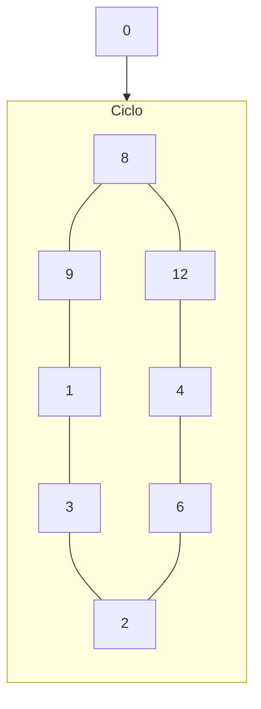

|  #  | $Q_3$ | $Q_2$ | $Q_1$ | $Q_0$ |     | $\overline{Q_3}$ | $\overline{Q_2}$ | $\overline{Q_1}$ | $\overline{Q_0}$ |
| :-: | :---: | :---: | :---: | :---: | :-: | :--------------: | :--------------: | :--------------: | :--------------: |
|  0  |   0   |   0   |   0   |   0   |     |        1         |        0         |        0         |        0         |
|  8  |   1   |   0   |   0   |   0   |     |        1         |        1         |        0         |        0         |
| 12  |   1   |   1   |   0   |   0   |     |        0         |        1         |        0         |        0         |
|  4  |   0   |   1   |   0   |   0   |     |        0         |        1         |        1         |        0         |
|  6  |   0   |   1   |   1   |   0   |     |        0         |        0         |        1         |        0         |
|  2  |   0   |   0   |   1   |   0   |     |        0         |        0         |        1         |        1         |
|  3  |   0   |   0   |   1   |   1   |     |        0         |        0         |        0         |        1         |
|  1  |   0   |   0   |   0   |   1   |     |        1         |        0         |        0         |        1         |
|  9  |   1   |   0   |   0   |   1   |     |        1         |        0         |        0         |        0         |

 

|  #   | $J_3$ | $K_3$ |     | $J_2$ | $K_2$ |     | $J_1$ | $K_1$ |     | $J_0$ | $K_0$ |
|:---:|:-----:|:-----:|:---:|:-----:|:-----:|:---:|:-----:|:-----:|:---:|:-----:|:-----:|
|  0  |   1   |   x   |     |   0   |   x   |     |   0   |   x   |     |   0   |   x   |
|  8  |   x   |   0   |     |   1   |   x   |     |   0   |   x   |     |   0   |   x   |
| 12  |   x   |   1   |     |   x   |   0   |     |   0   |   x   |     |   0   |   x   |
|  4  |   0   |   x   |     |   x   |   0   |     |   0   |   x   |     |   0   |   x   |
|  6  |   0   |   x   |     |   x   |   1   |     |   1   |   x   |     |   0   |   x   |
|  2  |   0   |   x   |     |   0   |   x   |     |   x   |   0   |     |   1   |   x   |
|  3  |   0   |   x   |     |   0   |   x   |     |   x   |   1   |     |   x   |   0   |
|  1  |   1   |   x   |     |   0   |   x   |     |   0   |   x   |     |   x   |   0   |
|  9  |   x   |   0   |     |   0   |   x   |     |   0   | x      |     |   x   |   1   |

