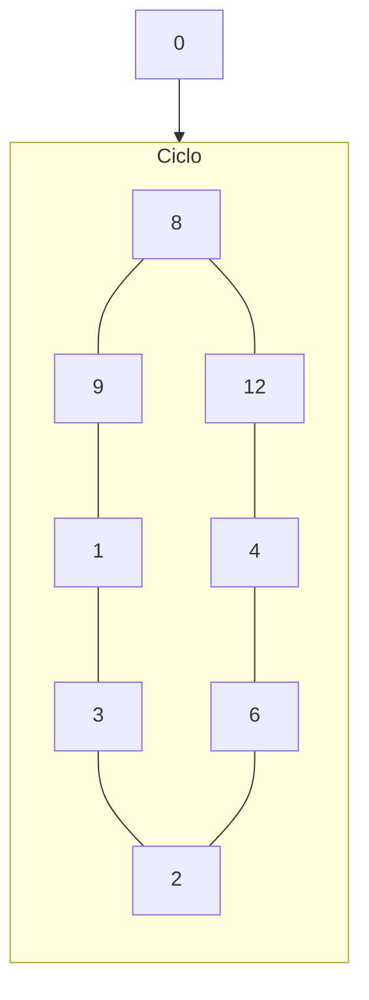

# Simulación 2: Contador síncrono

## Diagrama de estados

### Tabla de estados siguientes

|  #  | $Q_3$ | $Q_2$ | $Q_1$ | $Q_0$ |     | $\overline{Q_3}$ | $\overline{Q_2}$ | $\overline{Q_1}$ | $\overline{Q_0}$ |
| :-: | :---: | :---: | :---: | :---: | :-: | :--------------: | :--------------: | :--------------: | :--------------: |
|  0  |   0   |   0   |   0   |   0   |     |        1         |        0         |        0         |        0         |
|  8  |   1   |   0   |   0   |   0   |     |        1         |        1         |        0         |        0         |
| 12  |   1   |   1   |   0   |   0   |     |        0         |        1         |        0         |        0         |
|  4  |   0   |   1   |   0   |   0   |     |        0         |        1         |        1         |        0         |
|  6  |   0   |   1   |   1   |   0   |     |        0         |        0         |        1         |        0         |
|  2  |   0   |   0   |   1   |   0   |     |        0         |        0         |        1         |        1         |
|  3  |   0   |   0   |   1   |   1   |     |        0         |        0         |        0         |        1         |
|  1  |   0   |   0   |   0   |   1   |     |        1         |        0         |        0         |        1         |
|  9  |   1   |   0   |   0   |   1   |     |        1         |        0         |        0         |        0         |

### Tabla de transiciones

|  #  | $J_3$ | $K_3$ |     | $J_2$ | $K_2$ |     | $J_1$ | $K_1$ |     | $J_0$ | $K_0$ |
| :-: | :---: | :---: | :-: | :---: | :---: | :-: | :---: | :---: | :-: | :---: | :---: |
|  0  |   1   |   x   |     |   0   |   x   |     |   0   |   x   |     |   0   |   x   |
|  8  |   x   |   0   |     |   1   |   x   |     |   0   |   x   |     |   0   |   x   |
| 12  |   x   |   1   |     |   x   |   0   |     |   0   |   x   |     |   0   |   x   |
|  4  |   0   |   x   |     |   x   |   0   |     |   0   |   x   |     |   0   |   x   |
|  6  |   0   |   x   |     |   x   |   1   |     |   1   |   x   |     |   0   |   x   |
|  2  |   0   |   x   |     |   0   |   x   |     |   x   |   0   |     |   1   |   x   |
|  3  |   0   |   x   |     |   0   |   x   |     |   x   |   1   |     |   x   |   0   |
|  1  |   1   |   x   |     |   0   |   x   |     |   0   |   x   |     |   x   |   0   |
|  9  |   x   |   0   |     |   0   |   x   |     |   0   |   x   |     |   x   |   1   |

### Mapas de Karnaugh

$$J_3 =\overline{Q_2}\overline{Q_1}$$

$$K_3 = Q_2$$

$$J_2 = Q_3\overline{Q_0}$$

$$K_2 = Q_1$$

$$J_1 = \overline{Q_3}Q_2$$

$$K_1 = Q_0$$

$$J_0 = \overline{Q_2}Q_0$$

$$K_0 = Q_3$$

### Tabla de verdad (dígitos)

|  #  | $Q_3$ | $Q_2$ | $Q_1$ | $Q_0$ |     | $D$ | $U_3$ | $U_2$ | $U_1$ | $U_0$ |
|:---:|:-----:|:-----:|:-----:|:-----:|:---:|:---:|:-----:|:-----:|:-----:|:-----:|
|  0  |   0   |   0   |   0   |   0   |     |  0  |   1   |   0   |   0   |   0   |
|  8  |   1   |   0   |   0   |   0   |     |  0  |   1   |   1   |   0   |   0   |
| 12  |   1   |   1   |   0   |   0   |     |  1  |   0   |   1   |   0   |   0   |
|  4  |   0   |   1   |   0   |   0   |     |  0  |   0   |   1   |   1   |   0   |
|  6  |   0   |   1   |   1   |   0   |     |  0  |   0   |   0   |   1   |   0   |
|  2  |   0   |   0   |   1   |   0   |     |  0  |   0   |   0   |   1   |   1   |
|  3  |   0   |   0   |   1   |   1   |     |  0  |   0   |   0   |   0   |   1   |
|  1  |   0   |   0   |   0   |   1   |     |  0  |   1   |   0   |   0   |   1   |
|  9  |   1   |   0   |   0   |   1   |     |  0  |   1   |   0   |   0   |   0   |

 

|  #  | $U_3$ | $U_2$ | $U_1$ | $U_0$ |     |  A  |  B  |  C  |  D  |  E  |  F  |  G  |
|:---:|:-----:|:-----:|:-----:|:-----:|:---:|:---:|:---:|:---:|:---:|:---:|:---:|:---:|
|  0  |   0   |   0   |   0   |   0   |     |  1  |  1  |  1  |  1  |  1  |  1  |  0  |
|  1  |   0   |   0   |   0   |   1   |     |  0  |  1  |  1  |  0  |  0  |  0  |  0  |
|  2  |   0   |   0   |   1   |   0   |     |  1  |  1  |  0  |  1  |  1  |  0  |  1  |
|  3  |   0   |   0   |   1   |   1   |     |  1  |  1  |  1  |  1  |  0  |  0  |  1  |
|  4  |   0   |   1   |   0   |   0   |     |  0  |  1  |  1  |  0  |  0  |  1  |  1  |
|  5  |   0   |   1   |   0   |   1   |     |  1  |  0  |  1  |  1  |  0  |  1  |  1  |
|  6  |   0   |   1   |   1   |   0   |     |  1  |  0  |  1  |  1  |  1  |  1  |  1  |
|  7  |   0   |   1   |   1   |   1   |     |  1  |  1  |  1  |  0  |  0  |  0  |  0  |
|  8  |   1   |   0   |   0   |   0   |     |  1  |  1  |  1  |  1  |  1  |  1  |  1  |
|  9  |   1   |   0   |   0   |   1   |     |  1  |  1  |  1  |  1  |  0  |  1  |  1  |
| 10  |   1   |   0   |   1   |   0   |     |  1  |  1  |  1  |  1  |  1  |  1  |  0  |
| 11  |   1   |   0   |   1   |   1   |     |  0  |  1  |  1  |  0  |  0  |  0  |  0  |
| 12  |   1   |   1   |   0   |   0   |     |  1  |  1  |  0  |  1  |  1  |  0  |  1  |
| 13  |   1   |   1   |   0   |   1   |     |  1  |  1  |  1  |  1  |  0  |  0  |  1  |
| 14  |   1   |   1   |   1   |   0   |     |  0  |  1  |  1  |  0  |  0  |  1  |  1  |
| 15  |   1   |   1   |   1   |   1   |     |  1  |  0  |  1  |  1  |  0  |  1  |  1  |

### Mapa de Karnaugh (dígitos)

$$A = (\overline{U_2}(!U_0)) + (\overline{U_3}U_1) + (U_2U_0) + (U_3\overline{U_1})$$

$$B = (\overline{U_1}(!U_0)) + (\overline{U_2}) + (\overline{U_3}U_1U_0) + (U_3(!U_0)) + (U_3\overline{U_1})$$

$$C = (U_0) + (U_2U_1) + (U_3\overline{U_2}) + (\overline{U_3}\overline{U_1})$$

$$D = (U_2\overline{U_1}U_0) + (U_3U_2U_0) + (\overline{U_2}\overline{U_0}) + (\overline{U_3}U_1(!U_0)) + (\overline{U_3}\overline{U_2}U_1) + (U_3\overline{U_1})$$

$$E = (U_3\overline{U_1}(!U_0)) + (\overline{U_2}(!U_0)) + (\overline{U_3}U_1(!U_0))$$

$$F = (\overline{U_3}U_2\overline{U_1}) + (U_3\overline{U_2}\overline{U_1}) + (U_3U_2U_1) + (\overline{U_3}\overline{U_1}(!U_0)) + (\overline{U_3}U_2(!U_0)) + (U_3\overline{U_2}(!U_0))$$

$$G = (\overline{U_3}\overline{U_2}U_1) + (U_2\overline{U_1}) + (U_3\overline{U_1}) + (U_3U_2) + (\overline{U_3}U_1(!U_0))$$