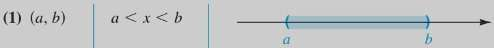
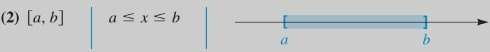
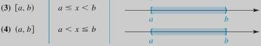
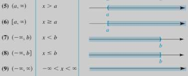

# Formulario Precálculo

En este formulario: $A,\ B,\ C,\ D,\ a,\ b,\ c,\ d,\ p,\ q,\ s \in\Bbb R$ y son constantes, $n,\ m \in \Bbb{Z}$ y $r \in \Bbb{Z}^{+}$

## Conjunto de Números Reales

### Propiedades de los números

|                                                               |                   Suma                    |               Multiplicación               |
| ------------------------------------------------------------- |:-----------------------------------------:|:------------------------------------------:|
| Ley conmutativa                                               |              $a + b = b + a$              |          $a \cdot b = b \cdot a$           |
| Ley asociativa                                                |        $(a + b) + c = a +(b + c)$         | $(a \cdot b) \cdot c = a \cdot(b \cdot c)$ |
| Elemento Neutro                                               |                 $a+(0)=a$                 |             $a \cdot (1) = a$              |
| Elemento inverso (recíproco)                                  |                $a+(-a)=0$                 |  $a \cdot \left(\frac{1}{a} \right) = 1$  |
| Ley distributiva de la multiplicación con respecto de la suma | $(a + b) \cdot c = a \cdot c + b \cdot c$ |                $\leftarrow$                |

### Fracciones

1. **Suma de fracciones**
	1. Mismo denominador: $\frac{a}{b} + \frac{c}{b} = \frac{a + c}{b}$
	2. Distinto denominador: $\frac {a}{b} + \frac {c}{d} =\frac {ad+bc}{cd}$
	3. Entero y una fracción : $a+\frac {c}{b} = \frac {ab+c}{b}$
2. **Multiplicación de fracciones:** $\frac {a}{b} \cdot \frac {c}{d} = \frac {ac}{bd}$
3. **Division de fracciones** **(cruzada).** $\frac {a}{b} \div \frac {c}{d} = \frac {ad}{bc}$
4. **Multiplicación por unidad.** $\frac{a}{b} \cdot \frac{c}{c} = \frac{a \cdot c}{b \cdot c} = \frac{a}{b}$

### Desigualdades

- **Mayor que ($>$):** $a-b = c \to a > b$, donde $c > 0$
- **Menor que ($<$):** $a-b = c \to a < b$, donde $c < 0$

### Valor absoluto

$$|a|= \begin{bmatrix} a\geq 0 \to |a| = a \\ a < 0 \to |a|= -a\end{bmatrix}$$

### Distancia entre dos puntos

- $d(A,B) =|b-a|$ 
- $d(B,A)= |a-b|$

## Leyes de los exponentes

| Nombre                                | Ley                                          |
| ------------------------------------- | -------------------------------------------- |
| **Ley de separación**                 | $(\frac{a}{b})^n = \frac {a^n} {b^n}$      |
| $\uparrow$                            | $(ab)^n =a^n b^n$                            |
| **Multiplicación de bases iguales**   | $a^n a^m = a^{n+m}$                          |
| **Potencia de una base con potencia** | $(a^n)^m = a^{nm}$                           |
| **Potencia cero**                     | $a^0 = 1$                                    |
| **Potencia negativa**                 | $a^{-n} = \frac {1} {a^n}$                  |
| **División de bases iguales**         | $\frac {a^n}{a^m} = a^{n-m} \ (si \ n>m)$ |
| $\uparrow$                            | $\frac {a^n} {a^m} = \frac {1} {a^{m-n}}$  |
| **De reescritura**                    | $a^{m/n} = \sqrt [n]{a^m}$                   |

## Leyes de los radicales

| Ley                                         | -                                           |
| ------------------------------------------- | ------------------------------------------- |
| **De separación**                           | $\sqrt [n]{ab} = \sqrt [n]{a} \sqrt [n]{b}$ |
| **De la raíz m\_ésima de la raíz n\_ésima** | $\sqrt [m] {\sqrt[n]{a}} = \sqrt [nm] {a}$  |
| $\downarrow$                                | $\sqrt [n]{a^n} = a$                        |
| **De cancelación**                          | $(\sqrt [n]{a})^n = a$                      |
| $\uparrow$                                  | $(a^n)^{1/n} = a$                           |
| **De reescritura**                          | $\sqrt [n]{a^m} = a^{m/n}$                  |

> [!warning]+ Advertencia
> - $\sqrt [n]{{a^n}\pm b^n} \neq a\pm b$
> - $\sqrt [n]{a\pm b}\neq a\pm b$

## Número imaginario

**Número imaginario**: $i = \sqrt{-1}$

- $i^0=1$
- $i^1=i$
- $i^2 = -1$
- $i^3 = i^2i=(-1)i = -i$
- $i^4 = i^2 i^2=(-1)(-1)=1$

**Número complejo**:  $z = a + bi \ | \ a \in \Bbb {R} \text{ y } bi \in \Bbb {I} \ \to \ Z \in \Bbb C$

## Operaciones con polinomios

- **Suma y resta (términos semejantes)**: $ab^{n}\pm b^n = b^n(a\pm 1)$
- **Multiplicación**: $a(b+c) = ab+ac$

### Productos Notables
| Nombre                      | Expresión | Equivalencia                   |
| --------------------------- | --------- | ------------------------------ |
| **Diferencia de cuadrados** | $a^2-b^2$ | $(a-b)(a+b)$                   |
| **Suma de cubos**           | $a^3+b^3$ | $(a+b)(a^2-ab+b^2)$            |
| **Diferencia de cubos**     | $a^3-b^3$ | $(a+b)(a^2+ab+b^2)$            |
| **Binomio al cuadrado**     | $(a+b)^2$ | $a^2+2ab+b^2$                  |
| **Binomio al cuadrado**     | $(a-b)^2$ | $a^2-2ab+a^2$                  |
| **Binomio al cubo**         | $(a+b)^3$ | $a^3+3a^2b+3ab^2+b^3$          |
| **Biniomio a la cuarta**    | $(a+b)^4$ | $a^4+4a^3+b+6a^2b^2+4ab^3+b^4$ |

## Binomio de Newton 

$$(a+b)^n=a^n+ \frac {n}{1!}a^{n-1}b+ \frac {n(n-1)}{2!}a^{n-2}b^2 + \frac {n(n-1)(n-2)}{3!}a^{n-3}b^3+ \cdots +b^n$$

## K_ésimo término 

$$K_{\text{ésimo}} \text{término} = \frac {n!}{(n-r+1)!(r-1)!} a^{n-r+1}\cdot b^{r-1}$$

> [!note]+ Nota
> 
> donde: 
> - $n =$ potencia,  $r$ = número del término a buscar y $n,r \in \Bbb{Z}^{+}$

## Factorización

**Por término común**: $x^2+ax = x(x+a)$

**Por fórmula**: Consultar las fórmulas de productos notables.

**Por agrupación:**

$$\displaylines{
ax+bx+ay+by\\   (ax+bx)+(ay+by) \\
x(a+b)+y(a+b) \\
(a+b)(x+y) \\
}$$

## Operaciones con números complejos en forma algebraica

$$\begin{array}{c|c|c}
\
\text{Suma y resta}             & \text{División} & \text{Multiplicación}\\
\eqalign{
z_{1}+z_{2} &= (a+bi) + (c+di)  \\
&=(a+c)(b+d)i
\\\\
z_{1}+z_{2} &= (a+bi) - (c+di) \\
&=(a-c)+(b-d)i  
}
& \displaylines{\frac{z_{1}}{z_{2}} = \frac{z_{1}}{z_{2}}\cdot \frac{z_{2}}{x_{2}}\\
 = \frac{a+bi}{c+di}\cdot \frac{c-di}{c-di}\\
 = \frac{ac + (bc-ad)i - bdi^{2}} {{c^{2}d^{2}i^{2}}}
}
& \eqalign{
z_{1}\cdot z_{2} &= (a+bi)(c+di)  \\
&= ac + bci + adi + bdi^{2}\\
&= ac + (bc+ad) + bdi^{2}\\
}
\end{array}$$

## Intérvalos y desigualdades

### Intérvalos

**Intérvalo abierto**: $(a,\ b) = x\ |\ a < x < b,\ x \in \Bbb {R}$

**Intérvalo cerrado**: $[a,\ b]={x\ |\ a\leq x\leq b,\ x\in \Bbb R}$

**Intérvalos semiabiertos**:

**Intérvalos infinitos**:

### Desigualdades

- Si $a>b$ y $b>c$, entonces $a>c$
- Si $a>b$, entonces $a+c > b+c$
- Si $a>b$ y $c>0$, entonces $ac > bc$
- Si $a>b$ y $c<0$, entonces $ac < bc$ 

> [!Note]+ Nota
> 
> Al multiplicar o dividir ambos lados de una desigualdad por un número real negativo, el signo de la desigualdad se invierte.

### Desigualdad con valor absoluto

| Caso |        Modelo         |         Solución         |
|:----:|:---------------------:|:------------------------:|
|  1   |  $\mid a\mid\ < b$   |       $-b < a < b$       |
|  2   | $\mid a\mid\ \leq b$ |    $-b \leq a \leq b$    |
|  3   |  $\mid a\mid\ > b$   |   $a < -b \cup a > b$    |
|  4   | $\mid a\mid\ \geq b$ | $a \leq -b \cup a\geq b$ |

## Ecuaciones cuadráticas (de segundo grado)

### Completar el cuadrado:

| Expresión original |        Término a sumar         |         Expresión Transformada          |           Equivalencia           |
|:------------------:|:------------------------------:|:---------------------------------------:|:--------------------------------:|
|      $x^2+kx$      | $\left(\frac{k}{2} \right)^2$ | $x^2+kx + \left(\frac{k}{2} \right)^2$ | $\left(x+\frac{k}{2} \right)^2$ |
|      $x^2-kx$      | $\left(\frac{k}{2} \right)^2$ | $x^2-kx + \left(\frac{k}{2} \right)^2$ | $\left(x-\frac{k}{2} \right)^2$ |

### Fórmula General

Para $ax^{2}+bx+c=0,\ a \neq 0$

$$x = \frac{-b\pm \sqrt {b^2-4ac}}{2a}$$

#### Discriminante

$D=b^2-4ac$

1. $D\ |\ D>0\Rightarrow$ Dos soluciones reales
2. $D\ |\ D<0\Rightarrow$ Dos soluciones complejas
3. $D\ |\ D=0\Rightarrow$ Solución repetida, una única solución 

### Método de Po-Shen Loh

$$ax^{2}+bx+c = \frac{d}{a}$$

Para factorizar esto podemos buscar dos números que multiplicados den $c$ y sumados den $b$. Se puede hacer por prueba y error o aplicando el **método de Po-shen Lo**:

1. Dividimos toda la expresión entre $a$ 

$$x{^{2}} + \frac{bx}{a} + \frac{c}{a} = \frac{d}{a}$$

2. Buscamos dos números que sumados den $\frac{b}{a}$, lo más sencillo es hacer cada uno de estos dos números dos números valgan la mitad de $\frac{b}{a}$ 

$$\displaylines
{p + q = \frac{b}{a}, & p = \frac{b}{2a}, & q = \frac{b}{2a} 
}$$
3. Le sumamos a $p$ una cantidad, pero a $q$ se le resta esa misma cantidad para mantener el equilibrio

$$\displaylines{
\frac{b}{2a} + s , & = \frac{b}{2a} - s
}$$
4. Buscamos los dos números que multiplicados den $\frac{a}{c}$ 

$$\displaylines{
\left(\frac{b}{2a} + s \right) \left(\frac{b}{2a} - s \right) = \frac{c}{a}\\
\frac{b^{2}}{4a^{2}} - s^{2} = \frac{c}{a}
}$$
5. Despejamos respecto a $s$

$$\displaylines{
s^{2} = \frac{b^{2}}{4a^{2}} - \frac{c}{a} \\
s = \sqrt {\frac{b^{2}-4ac} {4a^{2}}}
\\s = \pm \frac{\sqrt{b^{2}-4ac}}{2a}

}$$
6. Tomamos el valor de $s$, ya sea el positivo o el negativo.
7. Ahora solo sustituimos $s$

$$\displaylines{
\frac{b}{2a} + \frac{\sqrt{b^{2}-4ac}}{2a}, &&
\frac{b}{2a} - \frac{\sqrt{b^{2}-4ac}}{2a}
}$$

Entonces tenemos que 

$$\displaylines{
x{^{2}} + \frac{bx}{a} + \frac{c}{a} = \frac{d}{a}\\

\left(x + \frac{b +\sqrt{b^{2}-4ac}}{2a} \right) \left(x - \frac{b +\sqrt{b^{2}-4ac}}{2a} \right) = \frac{d}{a}\\
}$$

<!-- Asumiendo que tengamos el caso en el que $d = 0$, entonces

$$\displaylines{
(x+p)(x-q) = 0\\
x = -p = -\frac{b -\sqrt{b^{2}-4ac}}{2a} \\
x = -q = -\frac{b +\sqrt{b^{2}-4ac}}{2a}
}$$

-->

### Valor absoluto

$$\displaylines{
|x| = y\\
x = \pm y
}
$$
> [!info] Nota
> 
> La **raíz cuadrada** de una _variable elevada al cuadrado_ te da su **valor absoluto**, a menos que se sepa de antemano que _dicha variable_ es _positiva o negativa_.
> 
> $$\displaylines{
> \sqrt{x^{2}} = |x|\\
> \sqrt{x^{2}} = x,\ x>0\\
> \sqrt{x^{2}} = -x,\ x<0
> }$$

### Por agrupación

$x^2+ax+bx+ba=0$
$x(x+a)+b(x+a)=0$
$(x+a)(x+b)=0$

### Teorema del cero

Un producto que da 0 solo puede ser posible si por lo menos uno de los _factores_ es 0

**Una variable**:
$$\displaylines{
(x+a)(x+b) = 0\\\\
\
\begin{array}{l|l}
\text{Sol. 1} & \text{Sol. 2}\\
\
x+a=0 & x+b=0\\
x_1 = -a & x_2 = -b
\end{array}
}$$
**Dos variables**

$$\displaylines{
(x+a)(y+b) = 0\\\\
\
\begin{array}{l|l}
x+a=0 & y+b=0\\
x = -a & y = -b
\end{array}
}$$

En este caso puede haber 3 posibles soluciones

1. $x = -a, y= c$, donde $c$ puede tener cualquier valor.
2. $y = -b$, $x = d$, donde $d$ pude tener cualquier valor.
3. $x = -a, y = -b$

> [!tip] Recomendación
> 
> Recuerda siempre hacer _comprobación_ de todas las posibles soluciones para determinar cuál es la solución que satisface la ecuación.

### Por sustitución

$$ax^4+bx^2+c=0$$

1. Aplicar sustitución para simplicar la ecuación original

$$\displaylines{
\begin{array}{c|c}
x^2=u & x^4=u^2 
\end{array}\\
\
au^2+bu+c=0}
$$

2. Resolver la ecuación
3. Sustituir por los valores originales
4. Comprobación

## Fracciones Parciales

Siendo el grado de $f(x)$ menor que el de $g(x)$, entonces tenemos que

$$\frac{f(x)}{g(x)} = F_{1} + F_{2} +\cdots + F_r$$

tal que $F_{k}$ tiene una de las formas

$$\frac{A}{(ax+b)^{n}}\\ \text{ o }\\ \frac{A_{x} + B}{(ax^{2}+bx+c)^{n}}$$

**Factores lineales distintos**:

$$\frac{f(x)}{(ax+b)(cx+d)\cdots} = \frac{A}{ax+b} + \frac{B}{cx+d} +\dots \tag{1}$$

**Factores lineales repetidos**:

$$\frac{f(x)}{(ax+b)^{n}} = \frac{A}{ax+b} + \frac{B}{(ax+b)^{2}} + \cdots \tag{2}$$

**Factores cuadráticos distintos**:

$$\frac{f(x)}{(ax^{2}+bx+c)(dx^{2}+cx+f)} = \frac{Ax+B}{ax^{2}+bx+c} + \frac{Cx+D}{dx^{2}+ex+f} +\cdots \tag{3}$$

**Factores cuadráticos repetidos**:

$$\frac{f(x)}{(ax^{2}+bx+c)^{n}} = \frac{Ax+B}{ax^{2}+bx+c} + \frac{Cx+D}{(ax^{2}+bx+c)^{2}} +\cdots \tag{4}$$
### Procedimiento general

1. Asegurarse que el _grado_ del _numerador_ $f(x)$ sea menor que el del _denominador_; de ser el caso contrario, aplicar la _división larga_.
2. Factorizar el denominador en _factorles lineales_ $px + q$ o _factores cuadráticos irreducibles_.
3. Multiplicar los númeradores de cada $F_{k}$ por el _mínimo común múltiplo_, es decir, por cada uno de los _factores_, para poder convertir la expresión en _líneal_.
4. Igualar la expresión encontrada por el numerador $f(x)$.
5. Convertir la expresión en la forma.

$$f(x) = (a_1A+a_2B+\cdots)x + (a_{3}A+a_{4}B+\cdots)x^{2} +\cdots $$

6. Considerando que $f(x) = b_{1}x+ b_{2}x{^2} + \cdots$, entonces podemos _igualar los coeficientes_ de las _potencias semejantes_.de esta manera obtenemos un _sistema de ecuaciones_.
7. Sustituir en las _fracciones parciales_ los valores de $A, B, \cdots$.

#### Factores lineales no repetidos

En caso de que todos los factores del denominador sean _lineales no repetidos_ $(1)$, entonces podemos aplicar un método alternativo a partir del paso 4.

1. Sustituir los valores de $x$ que hagan que cada uno de los _factores lineales_ se conviertan en 0.
2. Resolver cada caso haciendo las sustituciones necesarias.
3. Sustituir en las _fracciones parciales_ los valores de $A, B, \dots$

<!--## 20. Fracciones 

21. Teorema del residuo y del factor
22. División sintética
23. Teoremas sobre polinomios
24. Gráficas de polinomios
25. 
26. Funciones exponenciales
27. Función Logaritmica
	27.1 Propiedades de los logaritmos
	27.2 Cómo graficar una función logaritmica
	27.3 Propiedades de los logaritmicas
	29. Funciones trigonométricas

---

# Referencias

- W., E. y A., J. (2009). Encontrar el determinante de una matriz (12a ed.). En S. R. Cervantes (Ed.), _Álgebra y trigonometría con geometría análitica_ (pp. 715-717). Editorial CENGAGE Learning.
--->
